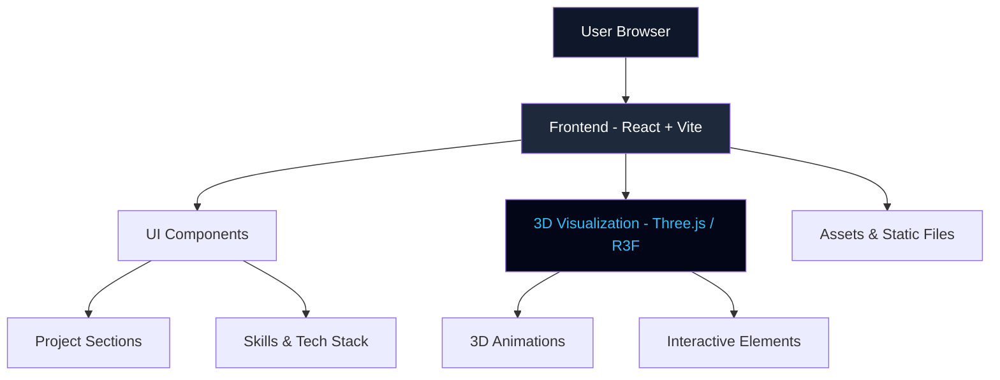

<h1 align="center"> Loganth's Portfolio </h1>

🚀 Personal portfolio showcasing AI systems, Cybersecurity tools, and Full-stack projects with a focus on real-world problem solving.

## 🧠 About This Project
This portfolio highlights my work in:
- 🤖 **Artificial Intelligence & Systems Engineering**
- 🔐 **Cybersecurity & Network Intelligence**
- ☁️ **Cloud & DevOps Technologies**
- 💻 **Full-Stack Development**

---

## 📂 Project Structure
```text
logan-portfolio/
│
├── public/              # Static assets
├── src/
│   ├── components/      # Reusable UI components
│   ├── sections/        # Page sections (Hero, Projects, Skills)
│   ├── assets/          # Images, icons, media
│   ├── utils/           # Helper functions
│   ├── App.tsx          # Main app component
│   └── main.tsx         # Entry point
│
├── index.html
├── package.json
├── tailwind.config.js
├── vite.config.ts
└── README.md
```
---

## System Architecture

---

## 🛠️ Tech Stack

### 🎨 Frontend


### 🌌 3D & Visualization


### ⚙️ Programming & Backend


### ☁️ Cloud & DevOps


### 🗄️ Databases


### 🛠️ Tools & Platforms


---

## ⚙️ Installation & Setup
🔹 Clone the Repository
```
git clone https://github.com/LoganthP/MyPortfolio.git
cd MyPortfolio
```
🔹 Install Dependencies
```
npm install
```
🔹 Run the Project
```
npm run dev
```
🔹 Build for Production
```
npm run build
```
🔹 Preview Build
```
npm run preview
```

---

## 🚀 Features

* ⚡ High-performance React + Vite setup
* 🎨 TailwindCSS modern UI
* 🧠 AI & Cybersecurity project showcase
* 🌌 3D Tech Stack visualization
* 📱 Fully responsive design
* 🔥 Smooth animations and interactions
